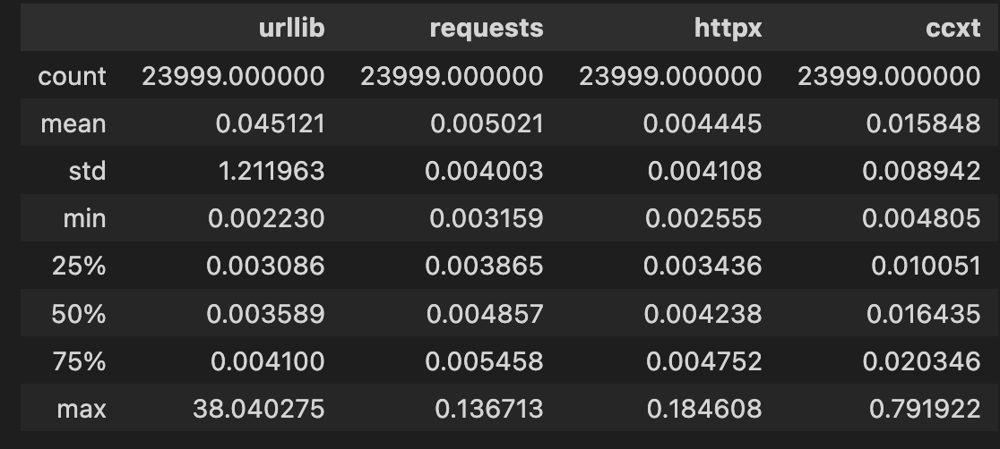
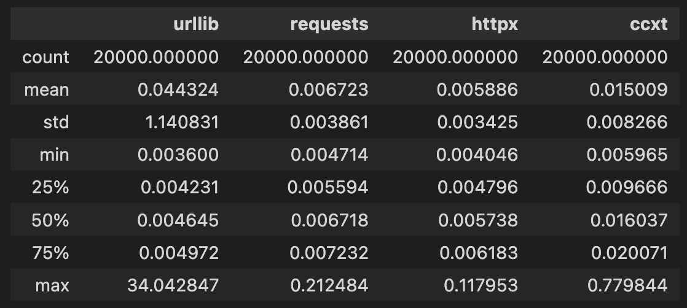
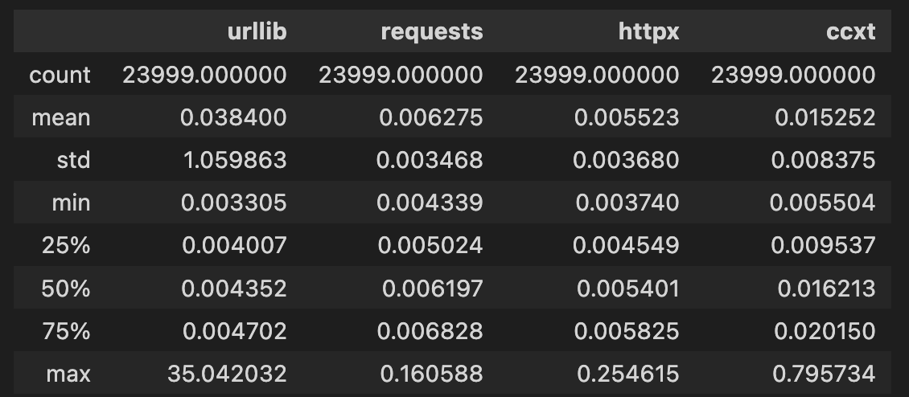

# AWS Parameters

## Region and AZ

Easy to test

- Binance's servers are located in Tokyo (we could further ensure this). 
- Try different AZ: a, c and d. 

### AZa

### AZc

### AZd

urllib has higher latency maybe due to the reason of reaching the limit of connection pooling.

requests under AZa is 25% faster than requests under AZc. httpx under AZa is 24.48% faster than httpx under AZc. However, AZa's latency std is slightly higher than AZc's.

The above results is only generated from one experiments. Since instances are launched randomly, there may be other factors affecting the results.

## Instance Types

Need credit

- t3.medium
- t3.large
- c6in.2xlarge
- c6i.xlarge
- c6i.2xlarge
- Memory Optimized machines.

## Networking

- [ ] Cluster placement group. This has been mentioned lots of times in the documents.
- [ ] AWS enhanced networking option
- [ ] [Improve network latency for Linux based Amazon EC2 instances]()
  - [ ] **Fine Tune Linux Kernel Configuration**
    - [ ] Busy poll mode.
    - [ ] Confiture CPU power states
    - [ ] ethtool
    
  - [ ] **ENA Driver Configuration**

https://docs.aws.amazon.com/AWSEC2/latest/UserGuide/ena-improve-network-latency-linux.html

https://aws.amazon.com/blogs/networking-and-content-delivery/aws-network-optimization-tips/

https://aws.amazon.com/what-is/latency/#:~:text=You%20can%20improve%20network%20latency,delaying%20other%20types%20of%20traffic.

 https://www.youtube.com/watch?v=DWiwuYtIgu0

# Redhat System Tuning Guide

https://access.redhat.com/documentation/en-us/red_hat_enterprise_linux_for_real_time/9
