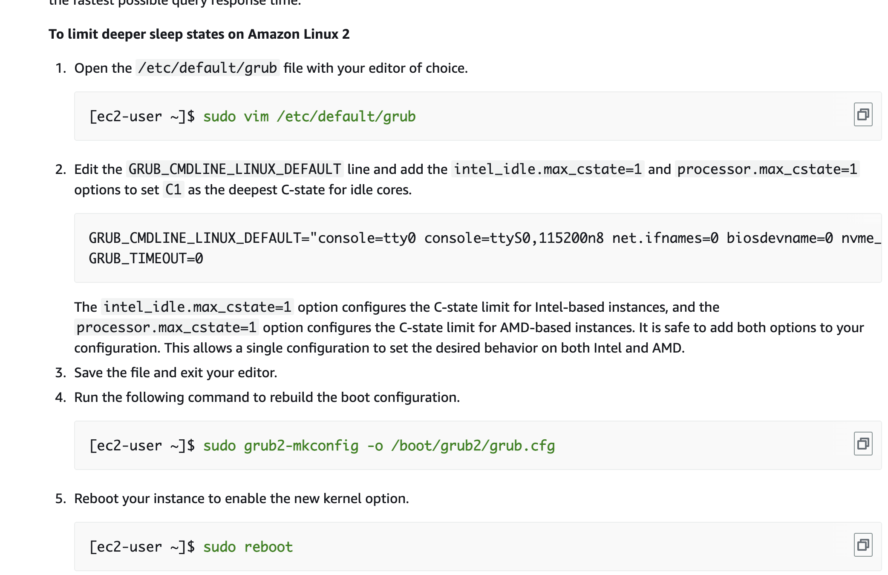

[toc]

# Bind Script to a Specific Core

```python
p = psutil.Process(os.getpid())
# Example of bind script to core 0
p.cpu_affinity([0])
```

# Interrupts

```shell
# Use Amazon Linux as an exmaple.
# Get the root access.
sudo -i
# Stop 
systemctl stop irqbalance

# Prevent going back to the default setting when restart the instance.
systemctl disable irqbalance

# Banning specific cores from handling interrupts
cd /etc/sysconfig
vim irqbalance

#Modify IRQBALANCE_BANNED_CPU=. Then the that CPU is banned to handle interrupts

cat /proc/interrupts
# Check interrupts of enx0

# Set the processor affinity for a spicific IRQ
# 62 correspond to the irq number of network card. Bind network interrupts to cpu core 1.
# 2 correspond to core 1.
echo 2 > /proc/irq/62/smp_affinity
```

# Enable Busy-Read & Busy Poll

```shell
# Make the kernel continusously checks for new data on a network socket, instead of wating for an interrupt signal.
sudo sysctl -w net.core.busy_read=50
sudo sysctl -w net.core.busy_poll=50
```


# High Performance and Low Latency by Limiting Deeper C-States

## Amazon Linus/Red Hat



## Ubuntu

1. Step 1 is the same.
2. Step 2 is the same.
3. Step 3 is the same.
4. `sudo grub-mkconfig -o /boot/grub/grub.cfg`
5. `sudo reboot`
